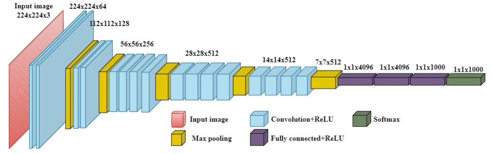

## Cuckoo Species Prediction

#### A supervised learning project whose purpose is classification of 10 different Cuckoo Species with the help of transfer learning.

The main goal is to increase the accuracy of classification through the help of data augmentation and transfer learning. The transfer learning model to be used is th VGG19 which is a convolutional neural network that is 19 layers deep. 

 
    *VGG19 model*